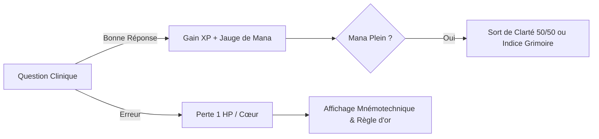

# ⚔️ ClinicHero - Spécifications Gamification & Med-RPG Neo-Retro

Document de référence décrivant la direction artistique, les mécaniques de jeu de rôle (RPG), le système de classes et l'architecture technique pour l'apprentissage sémiologique médical gamifié.

---

## 📖 1. Vision & Philosophie : *L'Ordre des Guérisseurs*

L'apprentissage de la sémiologie médicale est transposé dans l'univers de **l'Ordre des Guérisseurs d'Aethelgard**. L'objectif est d'offrir une motivation intrinsèque et ludique (rétro-gaming 16-bit moderne) tout en conservant une **exactitude clinique et scientifique 100% stricte**.

### Principes Clés
1. **Rigueur Médicale Intacte** : Les cas cliniques, questions, références (UNESS, Coustet, CNEC) et mécanismes physiopathologiques restent académiques et vérifiés.
2. **Meta-Game Immersif** : L'habillage RPG (mana, sorts, boss, avatars, inventaire) sert de catalyseur d'engagement sans infantiliser le contenu.
3. **Pédagogie Positive & Répétition Espacée** : La gamification renforce l'assiduité (streaks, quêtes quotidiennes, rituels de révision SRS).

---

## 🧙‍♂️ 2. Système de Classes Médicales

Chaque apprenant choisit un archétype à l'onboarding ou via son profil. Chaque classe dispose d'une arme signature et d'un passif de gameplay adapté :

| Classe | Filière & Affinité | Passif de Gameplay (*Trait*) | Arme Signature |
| :--- | :--- | :--- | :--- |
| **Clerc Auscultateur** | Médecine & Urgences (Auscultation, Bruits B1-B4, Souffles) | **Égide Clinique** : 1 joker d'erreur gratuit par session sur les questions d'auscultation. | *Stéthoscope de Lumière* |
| **Alchimiste Diagnosticien** | Pharmacie, Biologie & Biomarqueurs (Troponines, Gaz du sang) | **Transmutation d'XP** : +15% d'XP sur les questions d'associations et les cas cliniques. | *Fiole de Troponine Pure* |
| **Invocateur d'Ondes** | Électrophysiologie & Tracés (ECG 12 dérivations, Arythmies) | **Vision Arcanique** : Loupe d'analyse ECG et indices sur les segments P-Q-R-S-T. | *Sceptre Galvanométrique* |
| **Moine Biomécanicien** | Kinésithérapie, Ostéopathie & Palpation (Pouls, Manœuvres) | **Toucher Médical** : Bonus de score aux simulateurs de tension et manœuvres physiques. | *Gantelet de Palpation* |

---

## 🎨 3. Direction Artistique : *Neo-Retro 16-bit*

* **Design UI Moderne & Épuré** : Fond ardoise sombre (`slate-900`) et accents lumineux (`indigo-500`, `rose-500`, `amber-400`, `emerald-500`).
* **Bordures 3D Rétro & Boutons Tactiles** : Boutons et encadrés avec effet d'épaisseur rétro (`border-b-4`, `active:translate-y-1`).
* **Jauges Pixel/Segmentées** : Barres de Vie (HP) et de Mana (MP) segmentées style arcade.
* **Avatars Pixel-Art Évolutifs** :
  * **Niveau 1 – 5 (*Apprenti*)** : Tunique de lin et sacoche d'herboristerie.
  * **Niveau 6 – 15 (*Initié Guérisseur*)** : Cape brodée, stéthoscope d'argent scintillant.
  * **Niveau 16+ (*Archimage Sémiologue*)** : Tenue d'apparat dorée, halo d'ondes ECG et lauriers.
* **Effets Sonores Rétro (Web Audio API)** : Tonalités 8-bit discrètes pour les succès, passages de niveau et sorts (désactivables en un clic).

---

## 🎮 4. Mécaniques de Gameplay en Session



### A. Jauge de Mana & Sorts d'Aide
* Les bonnes réponses consécutives chargent la jauge de Mana (0 à 100 MP).
* **Sort de Clarté (30 MP)** : Élimine instantanément une proposition incorrecte.
* **Consultation du Grimoire (50 MP)** : Affiche le moyen mnémotechnique de la leçon sans pénaliser la note finale.

### B. Donjons & Combats de Boss
* Chaque module représente une **Région / Donjon** (ex: *La Citadelle Cardiovasculaire*).
* La dernière leçon d'un module est un **Combat de Boss (Cas Clinique en 3 Phases)** :
  1. **Phase 1 : Anamnèse & Tri d'Urgences** (identifier les drapeaux rouges).
  2. **Phase 2 : Examen Physique & Auscultation** (repérer le bruit/souffle pathologique).
  3. **Phase 3 : Synthèse & Diagnostic Positif** (sélectionner la prise en charge immédiate).

### C. Le Grimoire des Arcanes (Glossaire Sémiologique)
* Chaque terme médical découvert est inscrit comme un sort / concept dans le Grimoire du joueur avec sa définition, ses pièges et son étymologie.

---

## 🛠️ 5. Modélisation Base de Données (Prisma)

Extensions à intégrer au modèle `User` dans `prisma/schema.prisma` :

```prisma
model User {
  id                  String               @id @default(cuid())
  email               String               @unique
  password_hash       String
  name                String?
  profession          String?              @default("medecine")
  profession_autre    String?
  niveau_etudes       String?              @default("debutant")
  mode_apprentissage  String?              @default("complet")
  onboarding_complete Boolean              @default(false)
  xp_total            Int                  @default(0)
  user_level          Int                  @default(1)
  streak_days         Int                  @default(0)
  last_activity_date  DateTime?
  
  // === NOUVEAUX CHAMPS GAMIFICATION RPG ===
  character_class      String?              @default("clerc") // "clerc", "alchimiste", "mage_ecg", "moine"
  avatar_id            String?              @default("avatar_clerc_1")
  current_title        String?              @default("Initié Sémiologue")
  unlocked_titles_json String?              @default("[\"Initié Sémiologue\"]")
  inventory_json       String?              @default("[]") // Équipements débloqués
  mana_points          Int                  @default(100)
  
  created_at          DateTime             @default(now())
  updated_at          DateTime             @updatedAt
  lesson_progress     UserLessonProgress[]
  card_progress       UserCardProgress[]
}
```

---

## 🗺️ 6. Feuille de Route d'Implémentation

1. **Phase 1 : Socle RPG & Données**
   - Mise à jour du schéma Prisma (`character_class`, `avatar_id`, `current_title`).
   - Intégration du sélecteur de classe dans l'Onboarding et la page `/profile`.
2. **Phase 2 : Composants Visuels & Avatars**
   - Création du composant SVG Pixel-Art d'avatar avec sélecteur de style.
   - Intégration de la fiche de personnage et du badge de classe dans la `Navbar`.
3. **Phase 3 : Moteur de Gameplay en Session**
   - Intégration de la jauge de Mana et des sorts d'aide dans `CardPlayer.tsx`.
   - Ajout des effets sonores rétro 8-bit (Web Audio API).
4. **Phase 4 : Habillage Donjons & Boss**
   - Refonte visuelle de l'accueil `/` avec le chemin d'aventure des donjons.
   - Création du mode Boss (Cas clinique en 3 phases à la fin du Module 3).
